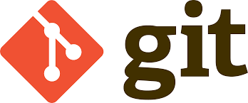
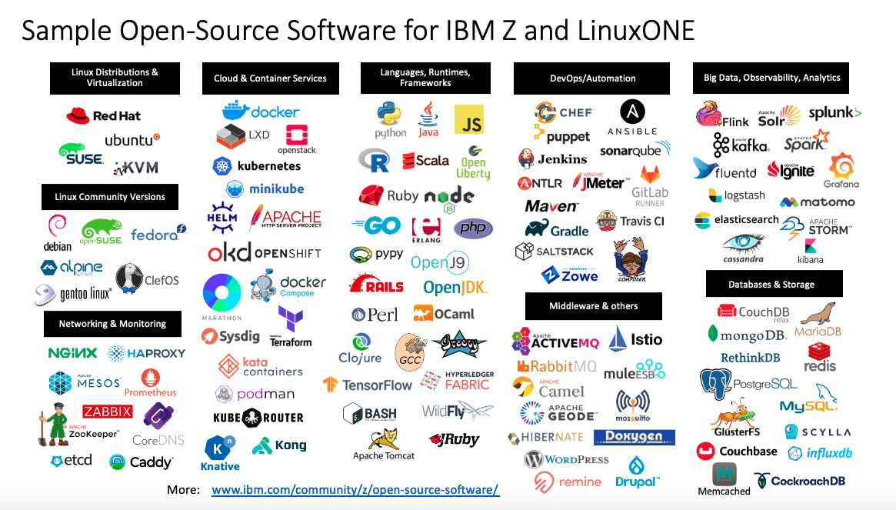

📌 Previous: 🏠 [Homepage](../README.md)

## 1. Open Source, Freemium, and Enterprise Software

---

### 1: Introduction to Software Models

- **What Are the Different Software Models?**
  1. **Open Source**: Free and modifiable by anyone.
  2. **Freemium**: Free with premium paid features.
  3. **Enterprise**: Paid, proprietary software with full features locked behind paywalls.

- Let’s explore each in detail!

---

### 2: What is Open Source?

- **Open Source Software** (OSS) is software that is freely available to use, modify, and distribute.
  - The **source code** is publicly accessible.
  - Promotes collaboration and community-driven development.

##### Examples of Open Source Software:
1. **Linux** - An operating system kernel widely used in servers, desktops, and mobile devices.
2. **GIMP** - A free alternative to Adobe Photoshop for image editing.
3. **Blender** - A powerful open-source tool for 3D modeling, animation, and rendering.
4. **LibreOffice** - An open-source office suite.
5. **Ubuntu** - A popular Linux-based operating system.
6. **Others** - react, vuejs, wordpress, vs code, mysql,  vlc, odoo, git, python, php, docker, etc
---

---

### 3: Freemium Model Explained

- **Freemium Software** offers basic features for free, while advanced features are available for a cost.
  - The free tier is functional but limited in features or usage.
  - Encourages users to upgrade for more advanced functionality.

##### Examples of Freemium Software:
1. **Dropbox** - Free storage with premium plans for more space.
2. **Spotify** - Free music streaming with ads, premium for offline and ad-free experience.
3. **Evernote** - Free note-taking with limits on devices and storage; premium unlocks more features.
4. **LinkedIn** - Free social networking, premium for advanced networking and job tools.
5. **Duolingo** - Free language learning with ads, premium for offline use and no ads.

---

### 4: Enterprise Software Explained

- **Enterprise Software** refers to paid, proprietary software designed for businesses, professionals, and commercial use.
  - Licensed and not modifiable by the user.
  - Often has extensive support and features tailored for large-scale usage.

##### Examples of Enterprise Software:
1. **Adobe Premiere Pro** - Video editing software with a subscription model.
2. **Adobe After Effects** - Tool for visual effects and motion graphics.
3. **Adobe Photoshop** - Industry-standard for photo editing and design.
4. **Microsoft Office Suite** - Word, Excel, PowerPoint, etc., for productivity in businesses.

---

### 5: Differences Between Open Source, Freemium, and Enterprise Software

| Feature                    | **Open Source**                  | **Freemium**                        | **Enterprise**                       |
|----------------------------|-----------------------------------|-------------------------------------|--------------------------------------|
| **Cost**                    | Free                             | Free with paid premium tiers        | Paid                                |
| **Source Code Access**      | Public and modifiable             | Closed, no access                   | Closed, no access                   |
| **Customization**           | High                             | Low                                 | None                                |
| **Support**                 | Community-driven or paid support | Limited (premium users may get support) | Full support from the provider    |
| **Target Audience**         | Individual users, developers      | Casual users, prosumers             | Businesses, professionals            |

---

### 6: Advantages of Open Source Software

1. **Cost-Effective**: Free to use and distribute.
2. **Transparency**: Anyone can review the source code for security and privacy concerns.
3. **Community Support**: Open-source projects often have a global community for support and continuous improvements.
4. **Customization**: Developers can modify the software to fit their specific needs.
5. **Innovation**: Allows faster evolution as developers around the world contribute.

---

### 7: Disadvantages of Open Source Software

1. **Support**: Often relies on community forums, which may not always be timely or reliable.
2. **User Experience**: Some open-source software may not be as polished or user-friendly as paid alternatives.
3. **Compatibility Issues**: Can sometimes have integration problems with proprietary systems or formats.
4. **Security Risks**: While open-source allows inspection for vulnerabilities, it also makes it easier for attackers to find exploits if software is not maintained properly.

---

### 8: The Freemium Business Model – Why It Works

- **Free for Users**: Encourages widespread adoption, especially by casual users.
- **Revenue from Premium Users**: Users who need more features, capacity, or services are willing to pay.
- **Constant Updates**: Companies can offer continuous improvements and features to encourage free users to convert to premium.

### Why Companies Love It:
- **Scalability**: Freemium models can support millions of users with a free tier while profiting from premium users.
- **User Engagement**: Free users provide feedback and help market the product.

---

### 9: Open Source and the Future

- **Rapid Innovation**: Open-source software drives innovation in fields like AI, cloud computing, and security.
- **Cross-Industry Impact**: From healthcare to education, open-source projects are creating new opportunities.
- **Open-Source Sustainability**: Many open-source projects are funded by donations, sponsorships, or companies that benefit from their development.

### Interesting Facts:
- **Red Hat**: A billion-dollar company that builds business models around open-source software.
- **Linux**: Powers most of the world's servers, smartphones, and supercomputers.

---

### 10: Conclusion – Choosing the Right Software Model

- **Open Source**: Ideal for developers, businesses looking for customizability, or users who want free software.
- **Freemium**: Great for casual users who want basic features with the option to upgrade.
- **Enterprise**: Best for large businesses and professionals who need robust, supported software with high performance and reliability.

---
### Final Thought:
Choosing between these models depends on your **needs, budget,** and **technical expertise**. Open-source is transforming industries, while freemium and enterprise models continue to serve commercial and casual needs alike.

➡️**Up Next:** 🗂️ [Introduction to Version Control](./1-2-git-github-intro.md)