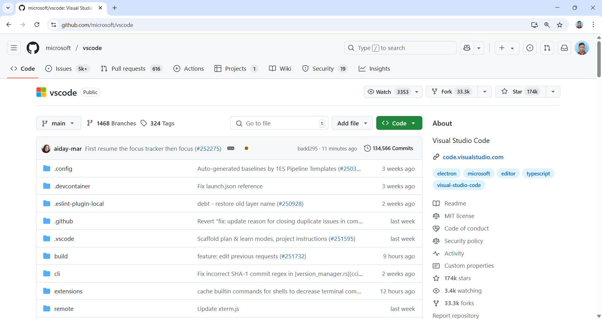
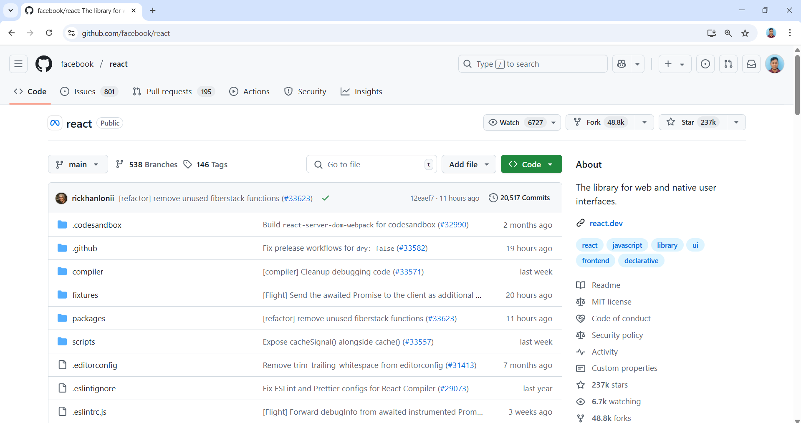

[ 🏠 Homepage](../README.md)

⬅️ **Previous:** [📂 Introduction to Open Source](./1-1-open-source.md)

## 2. Version Control and GitHub

###  1: Introduction to Version Control

- **What is Version Control?**

  - A system that helps track changes to files over time.

  - Enables collaboration on projects, even when people are working on the same file.

- **Why is it Important?**

  - Keeps a history of every change.

  - Helps you work on multiple features simultaneously.

  - Avoids overwriting each other’s work.

  - Useful for backups and recoveries.

---

###  2: What is Git?

- **Git** is a distributed version control system (VCS).

  - Tracks changes in files.

  - You can revert to previous versions.

  - It works locally, so you don’t need to be online to use Git.

- **How does Git Work?**

  - Git takes “snapshots” of files when you make a change.

  - Each snapshot is called a **commit**.
- Alternatives of Git
  - [Mercurial](https://www.mercurial-scm.org)
  - [Subversion (also known as SVN)](https://subversion.apache.org/)
  - [CVS (Concurrent Versions System) ](https://www.nongnu.org/cvs/)

---

###  3: What is GitHub?

-  [GitHub](https://github.com) is a platform to store Git repositories online.

  - Helps you share code with others.

  - Allows team members to collaborate from anywhere.

  - Facilitates teamwork with features like **Pull Requests** and **Issues**.

- **Why GitHub?**

  - It’s like cloud storage for your code.

  - Tracks, collaborates, and reviews code professionally.
- There are alterantives of GitHub,  Sourceforge, [Bitbucket](https://bitbucket.org/product) and [GitLab](https://about.gitlab.com)

###  4: GitHub Repository Example
- [vscode repository  example](https://github.com/microsoft/vscode)
 
---
- [react repository  example](https://github.com/facebook/react)
 

### 5: GitHub Advantages

- **Collaboration**: Work on projects with others from anywhere in the world.
- **Version History**: Access to all changes made in the past.
- **Issue Tracking**: Manage bugs and features.
- **Code Review**: Use pull requests to review and discuss code before merging.
- **Open Source Projects**: Collaborate with millions of developers.

➡️**Up Next:** [⬇️🛠️ Downloading and Installing Git and VS Code](./1-3-downloading-installing-git-vscode.md)