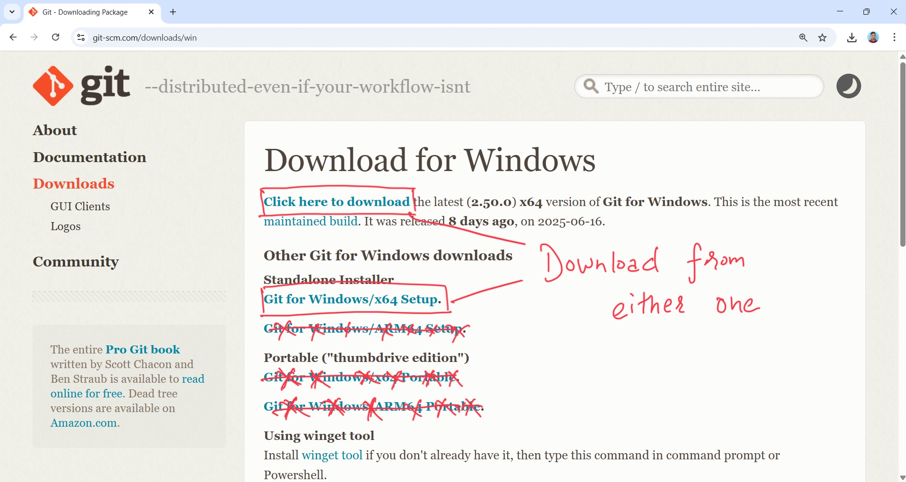
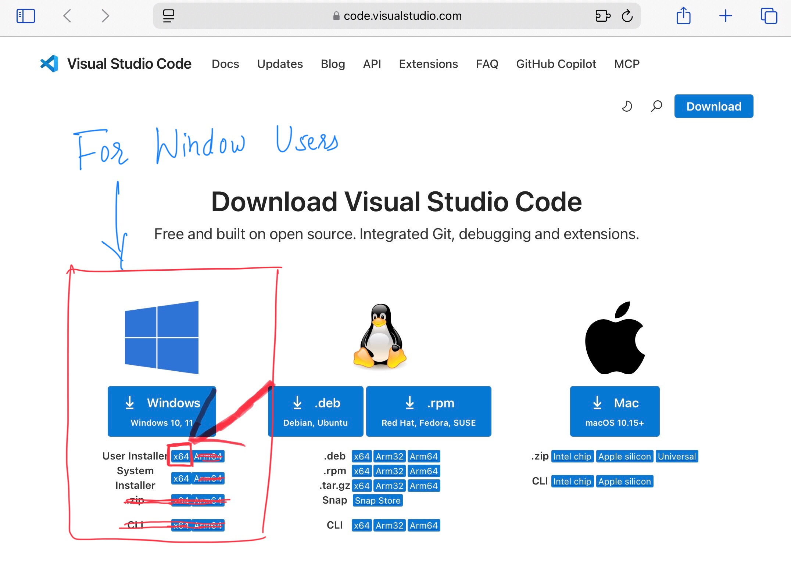

🏠 [Homepage](../README.md)

⬅️ **Previous:** 🗂️ [Introduction to Version Control](../day1/1-2-git-github-intro.md)

## 3. ⬇️🛠️ Downloading and Installing Git and VS Code

- Mac: `brew install git`

- Linux: `sudo apt-get install git`

- Windows: [Download Git ⬇️](https://git-scm.com/downloads/win) 

  

---

[Download VS Code ⬇️](https://code.visualstudio.com/download)

  

➡️**Up Next:** 👤 [Setting up GitHub Account](./1-4-setting-github.md)