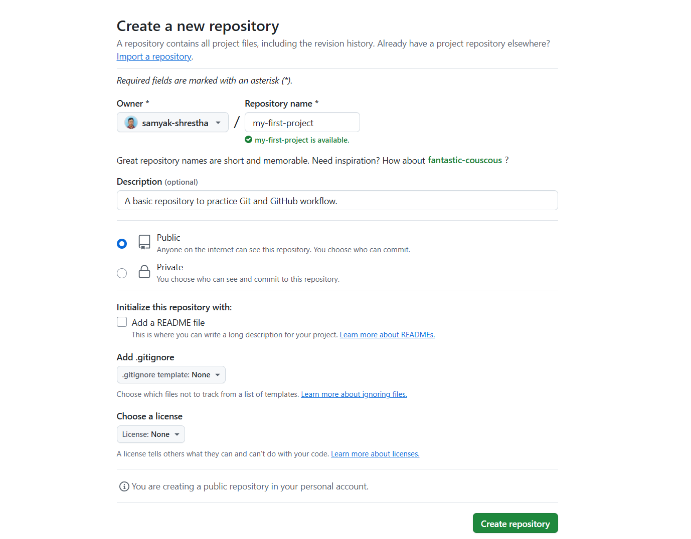

🏠 [Homepage](../README.md)

⬅️ **Previous:** 👤 [Setting up GitHub Account](./1-4-setting-github.md)

## 5. 🔧 Creating Your First GitHub Repository



### 🔧 Example of Creating Your First GitHub Repository

Follow these steps to create your first repository on GitHub. This guide explains each field with examples and tips.

---

#### 1. 📝 Repository Name
- It's a place where you can store your code, your files, and each file's revision history
**Example:**  
`my-first-repo`

✅ Tips:
- Use lowercase letters and hyphens instead of spaces
- Keep it short and meaningful  
- Avoid special characters or long names

---

#### 2. 🖊️ Description (Optional but Recommended)

**Example:**  
`A basic repository to practice Git and GitHub workflow.`

✅ Helps others understand what your project is about  
✅ Appears on your profile and search results

---

#### 3. 🔒 Repository Visibility

| Option     | Description                            | When to Choose               |
|------------|----------------------------------------|------------------------------|
| **Public** | Anyone can view your repository        | For open-source or practice  |
| **Private**| Only you (and collaborators) can view  | For school/private projects  |

> For learning: ✅ **Public** is usually the best choice.

---

#### 4. 📄 Initialize This Repository With:

##### ✅ README File

- Adds a starting `README.md` file to your repository.
- ✅ README file – acts as a project introduction; recommended
- ⚠️ When not to add – if you’re importing an existing repo via Git

**Example README Content:**
```markdown
# My First Repository
This is a practice repo for learning Git and GitHub.
```
✅ Check it if you're starting fresh
⚠️ Uncheck if you will push an existing project from your computer

#### 5. 🛑 .gitignore

-  A `.gitignore` file tells Git which files or folders to ignore so they are **not tracked** or committed to your repository.
- This helps you avoid pushing unnecessary or sensitive files (like passwords or large cache folders).
- What it does: tells Git which files to ignore (e.g., node_modules, env files)

**Example:**  
If you're creating a Python project, choose the **Python** template from the dropdown.

It will ignore files like:

```
pycache/
*.py[cod]
.env
```


**Other available templates:**  
- Node (for JavaScript/Node.js projects)  
- Java  
- Unity  
- C++  
- Many more…

✅ Choosing the right `.gitignore` keeps your repo clean and professional.

---

#### 6. 📜 License

Adding a license lets others know what they can or can’t do with your code or content.

| License            | Description                                                  | Best For                            |
|--------------------|--------------------------------------------------------------|-------------------------------------|
| **MIT**            | Very permissive. Allows reuse with attribution.              | ✅ Beginners, tutorials, open-source |
| **GPL**            | Requires derivative works to also be open source.            | Strict sharing & free software fans |
| **Apache 2.0**     | Like MIT but includes patent protection.                     | Enterprises and large projects      |
| **Creative Commons (CC-BY 4.0)** | For **non-code** content like documentation, tutorials, blog posts | ✅ Writers, educators, designers     |
| **None**           | No license = all rights reserved.                            | Private or restricted projects      |

> ⚠️ **Note:**  
> Use **Creative Commons licenses only for content**, not code.  
> For code, prefer MIT, GPL, or Apache.  
> For writing, art, or course material, **CC-BY 4.0** is a great choice — it allows reuse with credit.

**Example selection for students:**  
- Code project? ✅ Choose **MIT**  
- Writing a tutorial or guide? ✅ Choose **Creative Commons (CC-BY 4.0)**

---

#### 7. ✅ Final Step: Click "Create repository"

After completing the form and selecting the appropriate settings, click the green **"Create repository"** button.

You’ll be redirected to:
- Your new repository page
- A list of files (README, `.gitignore`, LICENSE if added)
- Options to upload, clone, or start committing code

---


➡️**Up Next:** 🔄 [Basic Git Workflow](./1-6-basic-git-workflow.md)