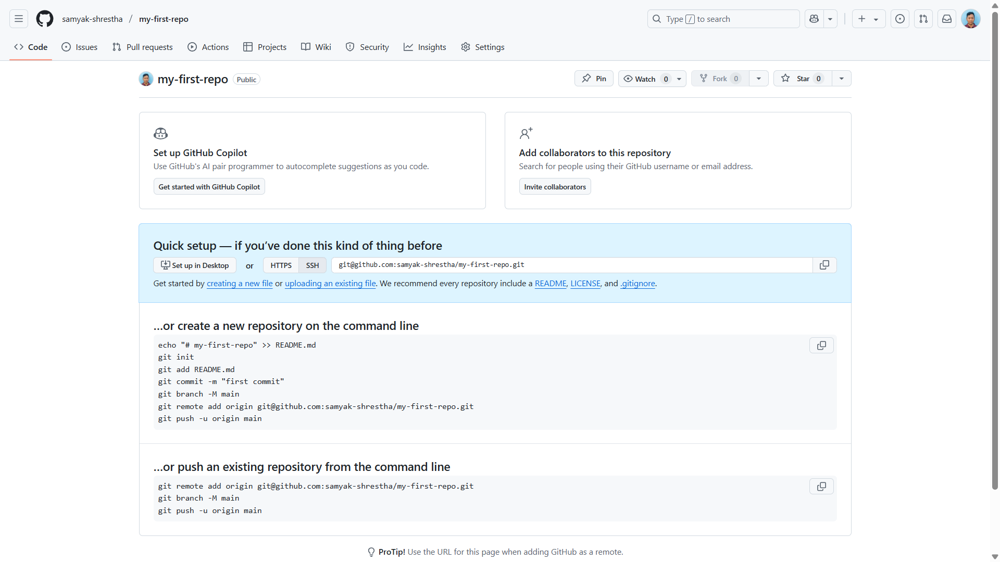

[ 🏠 Homepage](../README.md)

⬅️ **Previous:** [ 🔧 Creating Your First GitHub Repository](./1-5-creating-first-github-repo.md)

## 6. 🔄 Basic Git Workflow



### ✅ Setup & Configure Git (First Time Setup)
```bash
git config --global user.name "Your Name"
```
```bash
git config --global user.email "youremail@example.com"
```
_This configures your identity for commits._

### create README.md file
**Example README Content:**
[Markdown file format](../examples/markdown-file-syntax.md)
```markdown
# My First Repository
This is a practice repo for learning Git and GitHub.
```

### 🗂️ Initialize Repository

**Create a Repository**


  - A repository (repo) is like a project folder.

  - To create a new Git repo, run:

    ```bash
    git  init
    ```
### 📂 Stage & Commit Changes

- **Checking the Status**

  To see what files have changed:

    ```bash
    git status
    ```
---
- **Adding Files**

  - To start tracking a new or changed file:

    ```bash
    git  add  filename.txt
    ```

  - To add all changes:

    ```bash
    git  add  .
    ```

- **Commit Changes**

  - To save a snapshot of your changes:

    ```bash
    git  commit  -m  "Your commit message"
    ```


➡️**Up Next:**[📂 Understanding Repositories (Local vs Remote)](./1-7-local-vs-remote-repo.md)