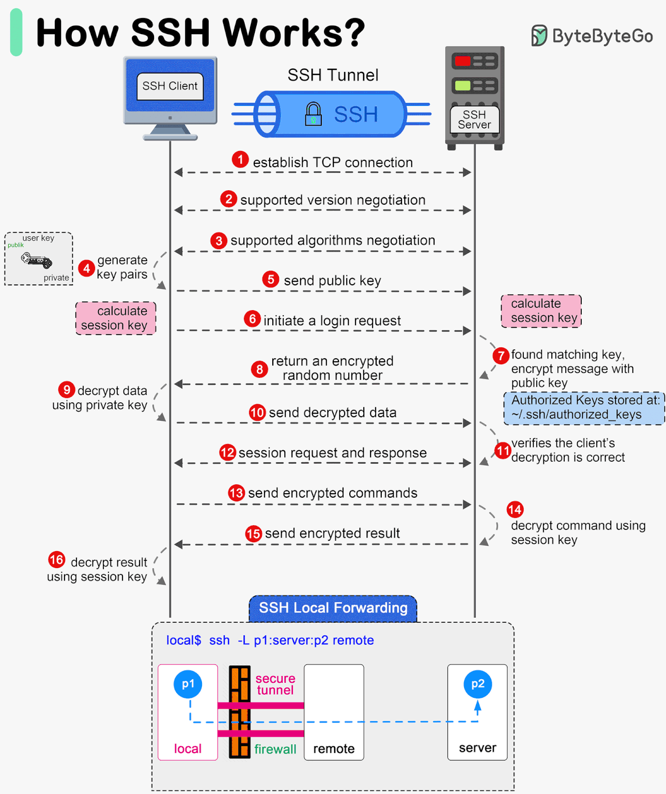

🏠 [Homepage](../README.md)

⬅️ **Previous:** 📂 [Understanding Repositories (Local vs Remote)](./1-7-local-vs-remote-repo.md)

## 8. 🔐 Setting up SSH Keys
SSH (Secure Shell) keys are a secure way to authenticate with GitHub and other Git-based platforms without using your username and password each time you interact with your repositories. In this guide, we’ll walk through how to generate SSH keys, add them to GitHub, and verify your setup.


- [Why SSH is important](#why-ssh-is-important)
- [Generating SSH keys](#generating-ssh-keys-pair-on-local-machine)
- [Adding SSH key to GitHub](#add-ssh-public-key-to-github)
- [Verifying SSH connection](#verifying-ssh-connection-to-github)

### Why SSH is Important
SSH provides a secure channel for communication between your computer and GitHub. Instead of sending your credentials in plaintext (which is insecure), SSH uses cryptographic keys for authentication.

**Benefits of SSH**:
- ✅ No need to enter your username and password for every Git interaction.
- 🔒 No plaintext passwords are sent over the internet.
- 🔐 Supports deploy-only access with read-only keys.
- 🚫 Avoids token or password leakage in public repositories.

### Generating SSH keys Pair on Local Machine
Open your terminal and run the following command to generate a new SSH key:
```bash
ssh-keygen -t ed25519 -C "your_email@example.com"
```

**Explanation**:
- `ssh-keygen`: Command to generate the key.

- `-t ed25519`: Specifies the key type. ed25519 is modern, secure, and faster than the older rsa type.

- `-C "your_email@example.com"`: A label/comment to help identify the key (usually your email).

#### What if I just run `ssh-keygen`?

If you run:
```bash
ssh-keygen
```

By default:
- It will generate an RSA key (usually 3072 or 4096 bits).
- It won’t add a helpful comment like your email.
- You may not get the benefits of newer, more secure algorithms like `ed25519`.

📝 Recommendation: Always use `ed25519` unless you need RSA for legacy systems

### Add SSH Public Key to GitHub

1. Locate your public key:
```bash
cat ~/.ssh/id_ed25519.pub
```

2. Copy the output, which looks like this:

```bash
ssh-ed25519 AAAAC3NzaC1lZDI1NTE5AAAAIE... your_email@example.com
```
3. Go to GitHub → Settings → SSH and GPG keys → New SSH key.

4. Paste the key, give it a name (e.g., My Laptop), and save.

### Verifying SSH Connection to GitHub
After adding your key, test the connection:

```bash
ssh -T git@github.com
```

Expected output:

```bash
Hi your-username! You've successfully authenticated, but GitHub does not provide shell access.
```

If you see this, you’re all set! 🎉

### Example: Using SSH with Git
Clone a repo via SSH:

```bash
git clone git@github.com:your-username/your-repo.git
```

Push changes:

```bash
git add .
git commit -m "Set up SSH"
git push origin main
```

You won’t be prompted for a password!


### Final Thoughts
Setting up SSH keys is a one-time task that saves time and enhances security in your development workflow. It’s especially useful if:

- You switch devices often.
- You automate deployments.
- You want to avoid constant reauthentication.

➡️**Up Next:** 🌐 [Connecting local repo to GitHub using SSH & Push to origin](./1-9-connecting-local-repo-to-remote-push.md)