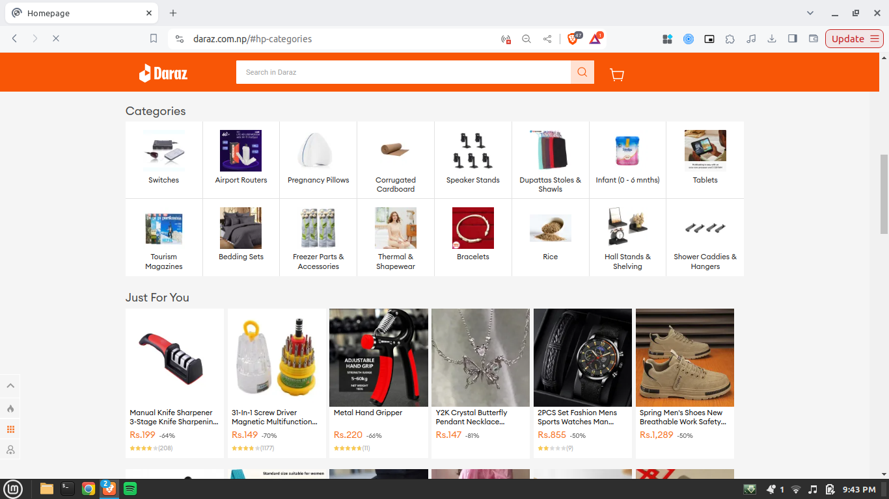

Example of a Markdown File for a Personal Website
Here's an example of a markdown file for a personal website, with image embedding, titles, paragraphs, and more:


### **Explanation of Markdown File Components**:
-   **Title (`#`)**: `# John Doe` creates the main title of the page.
-   **Image Embedding**: `` embeds an image, like a profile picture or project screenshot.
-   **Text Styling**: `**Bold**` creates bold text for highlighting key information.
-   **Headings**: `##` creates subheadings like “About Me” or “Skills”.
-   **Lists**: `-` creates bullet points for listing items.
-   **Links**: `[Link Text](URL)` creates hyperlinks for contact or project URLs.

---

This markdown file structure is simple and effective for showcasing your profile and projects in a concise manner. You can expand or modify the structure depending on your needs.


```markdown
# John Doe


Welcome to my personal website. I am a **Web Developer** with a passion for creating beautiful and functional websites.

---

## About Me

Hello! My name is **John Doe**. I am a full-stack web developer with 5 years of experience in building and maintaining responsive websites. I specialize in **React**, **Node.js**, and **CSS3**.

My interests include:

- Web Development
- Open Source Contribution
- Continuous Learning

---

## Skills

Here are some of the technologies I work with:

- **Languages**: HTML, CSS, JavaScript, Python
- **Frameworks**: React, Node.js, Express
- **Databases**: PostgreSQL, MongoDB
- **DevOps Tools**: Docker, Jenkins, AWS

---

## Projects

### E-Commerce Platform

An e-commerce platform built using **React** for the frontend and **Node.js** for the backend.


- **Features**:
  - Multi-vendor support
  - Real-time chat with customers
  - Secure payments with Stripe
  - Admin dashboard for inventory management

### Portfolio Website

A personal portfolio website showcasing my work and blog posts.


- **Tech Stack**: HTML, CSS, JavaScript
- **Features**: Responsive design, light/dark mode, contact form

---

## Contact Me

Feel free to reach out via email or through social media:

- Email: [johndoe@example.com](mailto:johndoe@example.com)
- LinkedIn: [linkedin.com/in/johndoe](https://linkedin.com/in/johndoe)
- GitHub: [github.com/johndoe](https://github.com/johndoe)


```
---
# John Doe


Welcome to my personal website. I am a **Web Developer** with a passion for creating beautiful and functional websites.

---

## About Me

Hello! My name is **John Doe**. I am a full-stack web developer with 5 years of experience in building and maintaining responsive websites. I specialize in **React**, **Node.js**, and **CSS3**.

My interests include:

- Web Development
- Open Source Contribution
- Continuous Learning

---

## Skills

Here are some of the technologies I work with:

- **Languages**: HTML, CSS, JavaScript, Python
- **Frameworks**: React, Node.js, Express
- **Databases**: PostgreSQL, MongoDB
- **DevOps Tools**: Docker, Jenkins, AWS

---

## Projects

### E-Commerce Platform

An e-commerce platform built using **React** for the frontend and **Node.js** for the backend.



- **Features**:
  - Multi-vendor support
  - Real-time chat with customers
  - Secure payments with Stripe
  - Admin dashboard for inventory management

### Portfolio Website

A personal portfolio website showcasing my work and blog posts.


- **Tech Stack**: HTML, CSS, JavaScript
- **Features**: Responsive design, light/dark mode, contact form

---

## Contact Me

Feel free to reach out via email or through social media:

- Email: [johndoe@example.com](mailto:johndoe@example.com)
- LinkedIn: [linkedin.com/in/johndoe](https://linkedin.com/in/johndoe)
- GitHub: [github.com/johndoe](https://github.com/johndoe)
